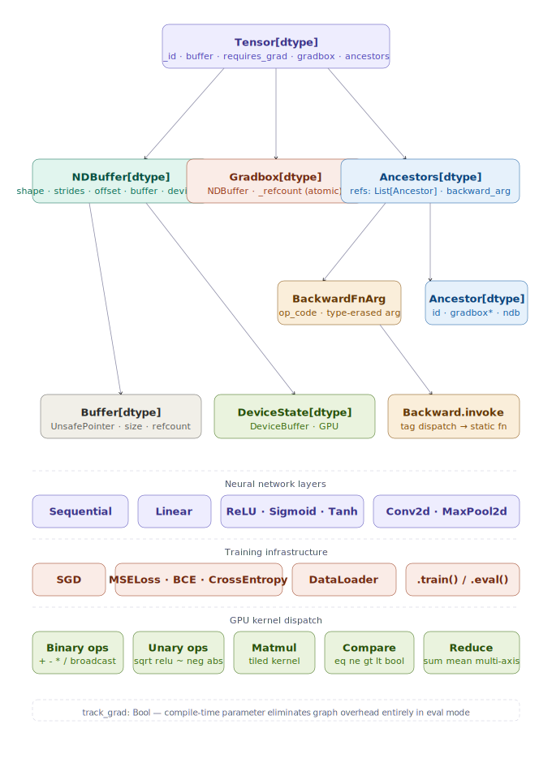
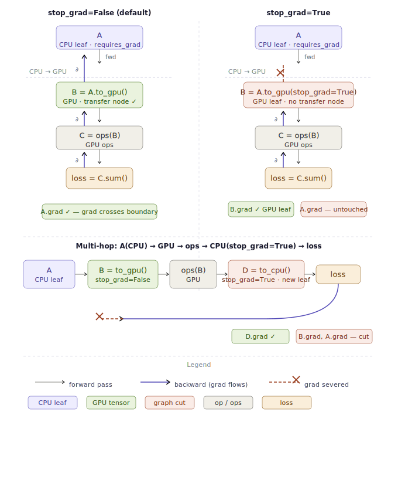

# Tenmo — Autograd Deep Dive

This document explains **how forward and backward pass work** in Tenmo's autograd system.

> ⚠️ **WIP** — Created to document the architecture clearly for users and contributors.

---
## 🏗️ Architecture



---
## Why This Matters

You could use PyTorch. It works. So why does Tenmo reimplement autograd from scratch in Mojo?

**1. You can read every line.**
No hidden CUDA kernels. No opaque `torch.autograd.Function`. Every backward pass is plain Mojo code in `backpropagation.mojo` — readable, checkable, optimizable.

**2. The design is principled.**
- Type-erased dispatch instead of variant explosion
- Lightweight ancestry handles instead of recursive Tensor copies
- Independent gradbox refcounting for memory safety
- Compile-time graph elimination (`track_grad: Bool`)

**3. Zero overhead in inference.**
`model.eval()` switches off gradient tracking at compile time. No runtime `if requires_grad:` branches. Pure forward binary.

**4. GPU-native.**
Gradient flow crosses CPU↔GPU boundaries automatically.

If you want to *understand* autograd — not just use it — this document walks through the real implementation.

---

## 1. The Core Data Structures

### Tensor Fields

```mojo
struct Tensor[dtype: DType]:
    var _id: UInt                           # unique identity for graph traversal
    var buffer: NDBuffer[Self.dtype]       # shape, strides, offset, data (single source of truth)
    var requires_grad: Bool                 # gradient tracking flag
    var gradbox: UnsafePointer[Gradbox]    # gradient storage (allocated only when needed)
    var ancestors: Optional[Ancestors]       # lightweight parent handles for autograd graph
```

### Gradbox — Gradient Storage

```mojo
struct Gradbox[dtype: DType]:
    var buffer: NDBuffer                    # contiguous gradient storage
    var _refcount: UnsafePointer         # independent refcount — survives tensor destruction
```

**Key design**: Gradbox has its own refcount. When Mojo ASAP-destroys an intermediate tensor, the gradbox survives if other ancestors still reference it.

### Ancestor — Lightweight Parent Handle

```mojo
struct Ancestor[dtype: DType]:
    var _id: UInt                     # graph traversal
    var requires_grad: Bool         # grad routing decision
    var gradbox: UnsafePointer      # refcounted pointer to gradient storage
    var layout: Layout             # shape + strides + offset (copied once)
    var storage: Storage           # Buffer or DeviceState (refcount bump only)
    var parents: Optional[Ancestors] # recursive graph structure
```

**Why not store full Tensors?** The old design copied entire Tensors at every `add_ancestry` call — triggering recursive copies, gradbox allocations, and heap blocks. `Ancestor` carries only what backward actually needs.

### BackwardFnArg — Type-Erased Operation Argument

```mojo
struct BackwardFnArg[dtype: DType]:
    var op_code: Int                     # dispatch tag (e.g., BACKWARD_MULTIPLY_SCALAR)
    var ptr: UnsafePointer[UInt8]        # type-erased argument (scalar, shape, etc.)
    var destroy: DestroyerFn              # custom destructor
    var copy_fn: CopyFn                # custom copier
```

This is the key: a **jump table** dispatch instead of variant extraction.

---

## 2. Forward Pass — Building the Computational Graph

### Example: `c = a * 42 + b`

```mojo
var a = Tensor.d1([1.0, 2.0, 3.0], requires_grad=True)
var b = Tensor.d1([1.0, 2.0, 3.0], requires_grad=True)

var c = a * 42 + b
```

### Step-by-step:

#### 2.1 `a * 42` (MultiplyScalar.forward)

From `tenmo/multiplication.mojo`:

```mojo
fn forward[track_grad: Bool = True](self, factor) -> Tensor:
    var out = Tensor(self.buffer.scalar_ops[Multiply](factor), requires_grad=False)

    comptime if track_grad:
        if self.requires_grad:
            out.requires_grad_(True)
            # Create type-erased argument containing scalar factor 42
            var backwardFnArg = BackwardFnArg.scalar_arg(BACKWARD_MULTIPLY_SCALAR, factor)
            out.add_ancestry(backwardFnArg^, self)  # record parent
    return out
```

**What happens:**
1. Buffer performs element-wise multiplication: `[1,2,3] * 42 = [42,84,126]`
2. If `a.requires_grad = True`, set output's gradient flag
3. Create `BackwardFnArg` with opcode `BACKWARD_MULTIPLY_SCALAR` and value `42`
4. Call `out.add_ancestry(backwardFnArg^, self)` — stores:
   - The backward function dispatch tag
   - A lightweight `Ancestor` handle to `a` (not a full copy!)

#### 2.2 `result + b` (Adder.forward)

From `tenmo/addition.mojo`:

```mojo
fn forward[track_grad: Bool = True](self, other) -> Tensor:
    var out = Tensor(self.buffer.arithmetic_ops[Add](other.buffer), requires_grad=False)

    comptime if track_grad:
        if self.requires_grad or other.requires_grad:
            out.requires_grad_(True)
            if self.shape() == other.shape():
                var backwardFnArg = BackwardFnArg.null_arg(BACKWARD_ADD)
                if self.requires_grad and other.requires_grad:
                    out.add_ancestry(backwardFnArg^, self, other)  # two parents
                elif self.requires_grad:
                    out.add_ancestry(backwardFnArg^, self)       # one parent
                else:
                    out.add_ancestry(backwardFnArg^, other)
            else:
                var backwardFnArg = BackwardFnArg.null_arg(BACKWARD_ADD_BROADCAST)
                out.add_ancestry(backwardFnArg^, self, other)  # broadcast case
    return out
```

**What happens:**
1. Buffer performs element-wise addition: `[42,84,126] + [1,2,3] = [43,86,129]`
2. Sets up ancestry with `BACKWARD_ADD` opcode
3. Records parent handles to both tensors that require gradients

---

## 3. Backward Pass — Computing Gradients

### Triggering Backward

```mojo
var loss = c.sum()   # Scalar loss for gradient computation
loss.backward()     # Initiates reverse-mode differentiation
```

### The Dispatch Mechanism

From `tenmo/backpropagation.mojo`:

```mojo
struct Backward[dtype: DType](RegisterPassable & ImplicitlyCopyable):
    @staticmethod
    def invoke(
        output: Ancestor[Self.dtype],
        mut parent_ids: List[UInt],
    ):
        if not output.has_ancestry():
            return
        ref arg = output.ancestry().backward_fn_arg()
        var op_code = arg.op_code

        # Direct jump table — no variant extraction!
        if op_code == BACKWARD_ADD_SCALAR:
            AddBackwardScalar[Self.dtype].backward(output, parent_ids)
        elif op_code == BACKWARD_ADD:
            AddBackward[Self.dtype].backward(output, parent_ids)
        elif op_code == BACKWARD_MULTIPLY_SCALAR:
            MultiplyBackwardScalar[Self.dtype].backward(output, parent_ids)
        elif op_code == BACKWARD_MULTIPLY:
            MultiplyBackward[Self.dtype].backward(output, parent_ids)
        # ... and so on for 50+ operations
```

Each handler receives a `mut parent_ids: List[UInt]` that it fills with the IDs of
parents that received gradient updates. The caller uses this list to decrement
fan-in counters. Handlers call `parent.update_grad()` internally — no return value.

### Example: Backward for `a * 42`

From `tenmo/multiplication.mojo`:

```mojo
struct MultiplyBackwardScalar[dtype: DType](
    ImplicitlyCopyable, RegisterPassable
):
    @staticmethod
    def backward(
        output: Ancestor[Self.dtype],
        mut parent_ids: List[UInt],
    ):
        # Retrieve the scalar factor from the type-erased argument
        var factor = output.ancestry()
            .backward_fn_arg()
            .get[ScalarArg[Self.dtype]]()
            .value  # = 42

        # Get incoming gradient from downstream
        ref gradbox = output.gradients()  # ∂loss/∂c

        # Scale gradient: ∂loss/∂a = ∂loss/∂c * ∂c/∂a = grad * 42
        var scaled_gradbox = gradbox * factor

        # Accumulate into parent's gradbox and register for fan-in
        ancestor.update_grad(scaled_gradbox^, AddTensor, None)
        parent_ids.append(ancestor._id)
```

### Example: Backward for `a + b`

From `tenmo/addition.mojo`:

```mojo
struct AddBackward[dtype: DType](ImplicitlyCopyable, RegisterPassable):
    @staticmethod
    def backward(
        output: Ancestor[Self.dtype],
        mut parent_ids: List[UInt],
    ):
        var gradbox = output.gradbox[]
        count = len(output.ancestry())

        if count == 1:  # Only one parent needed grad
            var ancestor = output.ancestry().get(0)
            ancestor.update_grad(gradbox^, AddTensor, None)
            parent_ids.append(ancestor._id)
        else:  # Both parents might need grad
            var ancestor_lhs = output.ancestry().get(0)  # a
            var ancestor_rhs = output.ancestry().get(1)  # b

            if ancestor_lhs.requires_grad:
                ancestor_lhs.update_grad(gradbox, AddTensor, None)
                parent_ids.append(ancestor_lhs._id)
            if ancestor_rhs.requires_grad:
                ancestor_rhs.update_grad(gradbox, AddTensor, None)
                parent_ids.append(ancestor_rhs._id)
```

**Key insight**: For addition, ∂(a+b)/∂a = ∂(a+b)/∂b = 1, so the gradient passes through unchanged.

---

## 4. The Full Forward-Backward Trace

### Forward:

```
a = [1,2,3], requires_grad = True
b = [1,2,3], requires_grad = True

c = a * 42
  → c = [42,84,126]
  → ancestors = [Ancestor(a)], backward_fn_arg = BACKWARD_MULTIPLY_SCALAR(42)

d = c + b
  → d = [43,86,129]
  → ancestors = [Ancestor(c), Ancestor(b)], backward_fn_arg = BACKWARD_ADD
```

### Backward:

```
loss = d.sum() = 258
loss.backward()
  → Phase 1: seed gradbox of d (loss) with [1]

  → Phase 2: DFS from d → ancestors of c, b → ancestors of a
             fanin: {d:0, c:1, b:1, a:1}  (c depends on d, b depends on d ...)

  → Phase 3: ready_queue = [d]
     pop d → Backward.invoke(d, parent_ids)
        op_code = BACKWARD_ADD
        grad_d = [1,1,1]
        propagates to c: c.update_grad(grad_d, AddTensor)  → c.grad = [1,1,1]
        propagates to b: b.update_grad(grad_d, AddTensor)  → b.grad = [1,1,1]
        parent_ids = [c._id, b._id]
        fanin: {c:0, b:0, a:1}  → enqueue c, b

     pop c → Backward.invoke(c, parent_ids)
        op_code = BACKWARD_MULTIPLY_SCALAR
        grad_c = [1,1,1], factor = 42
        a.update_grad(grad_c * 42, AddTensor)              → a.grad = [42,84,126]
        parent_ids = [a._id]
        fanin: {a:0, b:0}  → enqueue a

     pop b → Backward.invoke(b, parent_ids)
        op_code = BACKWARD_ADD_SCALAR
        b has no ancestry → returns, parent_ids empty
        fanin: {a:0}  → nothing to enqueue

     pop a → Backward.invoke(a, parent_ids)
        a has no ancestry (leaf) → returns, parent_ids empty
        fanin: {}  → done
```

**Final gradients:**
- `a.grad() = [42, 84, 126]` — because ∂(a*42)/∂a = 42
- `b.grad() = [1, 1, 1]` — because ∂(c+b)/∂b = 1

---

## 5. Key Design Decisions

### Why BackwardFnArg is type-erased?

```mojo
struct BackwardFnArg:
    var op_code: Int                     # dispatch tag
    var ptr: UnsafePointer[UInt8]        # type-erased payload
    var destroy: DestroyerFn              # custom destructor
    var copy_fn: CopyFn                  # custom copier
```

- **No variant explosion**: Each op doesn't need a custom Variant type
- **Direct jump table**: Integer tag → static method, no runtime type extraction
- **Custom cleanup**: Each argument type knows how to destroy/copy itself

### Why Ancestor instead of Tensor copies?

| Full Tensor Copy | Ancestor Handle |
|----------------|----------------|
| Recursive gradbox allocation | No new gradbox |
| Full NDBuffer copy | Layout + Storage refcount bump |
| Copy backwardFnArg heap block | Reference existing argument |
| O(n) per ancestry entry | O(1) per ancestry entry |

### Why Gradbox has independent refcount?

When Mojo ASAP-destroys intermediate tensors:
1. `Tensor.__del__` decrements gradbox refcount
2. If other `Ancestor` copies in graph still reference it → refcount stays > 0
3. Last owner (graph root) frees the gradbox

This prevents **dangling pointers** in the autograd graph.

### Why track_grad is compile-time?

```mojo
fn forward[track_grad: Bool = True](self, factor):
    # If track_grad = False at compile time:
    # - No graph building code generated
    # - No ancestry setup
    # - Pure forward pass binary
    # If track_grad = True:
    # - Full graph construction
```

Using `model.eval()` switches the implicit default to `False` — zero overhead in inference.

---

## 6. Operation Support

Tenmo supports **50+ operations** with backward passes:

| Category | Operations |
|----------|-----------|
| Arithmetic | `+`, `-`, `*`, `/`, `**` |
| Scalar variants | `tensor + scalar`, `tensor * scalar` |
| Reductions | `sum`, `mean`, `max`, `min` |
| Linear Algebra | `matmul`, `dot`, `vector_matmul`, `matrix_vector_mul` |
| Activations | `relu`, `sigmoid`, `tanh`, `softmax` |
| Reshaping | `reshape`, `flatten`, `squeeze`, `unsqueeze`, `transpose`, `permute` |
| View ops | `view`, `expand`, `tile`, `repeat` |
| Utility | `concat`, `stack`, `pad`, `clip` |
| Loss | `mse_loss`, `cross_entropy`, `bceloss` |

Each operation follows the same pattern:
1. **Forward**: Compute result, record `BackwardFnArg` + parent `Ancestor` handles
2. **Backward**: Dispatch via op_code, compute gradient contributions, accumulate to parents

---

## 7. GPU Support

Most forward and backward operations work on GPU:
- Tensor arithmetic, reductions, activations, etc.
- Kernel dispatch (CPU vs GPU) happens inside NDBuffer operations
- `DType.bool` is handled correctly via internal `uint8` storage

```mojo
var a = Tensor.d2([[1,2],[3,4]], requires_grad=True)
var a_gpu = a.to_gpu()
var b = a_gpu * 2
var loss = b.sum()
loss.backward()
a.grad().print()  # Gradients flow back to original CPU tensor
```

### Gradient Flow Across Device Boundaries

The `stop_grad` parameter on `to_gpu()` and `to_cpu()` controls whether a device
transfer registers a backward node in the compute graph. This lets you choose
between full cross-device grad flow and GPU-native training where weights live
permanently on the GPU.



#### `stop_grad=False` (default) — transparent boundaries

The transfer registers a `DeviceTransferBackward` node. Gradients tunnel through
device boundaries as if no transfer happened. The origin tensor receives its
gradient exactly as it would from a same-device computation.

```mojo
var a = Tensor.d1([1.0, 2.0, 3.0], requires_grad=True)  # CPU leaf
var b = a.to_gpu()          # stop_grad=False — transfer node registered
var loss = (b * 2).sum()
loss.backward()
# grad flows: loss → ops → b → DeviceTransferBackward → a
a.grad().print()            # ✓ [2.0, 2.0, 2.0]
```

#### `stop_grad=True` — new leaf on target device

No backward node is registered. The destination tensor becomes a new independent
leaf on the target device. Gradients accumulate there and never cross back.

```mojo
var a = Tensor.d1([1.0, 2.0, 3.0], requires_grad=True)  # CPU leaf
var b = a.to_gpu(stop_grad=True)   # B is a new GPU leaf — graph severed
var loss = (b * 2).sum()
loss.backward()
b.grad().print()   # ✓ [2.0, 2.0, 2.0]  grad stays on GPU
a.grad().print()   # untouched — backward never crossed the boundary
```

#### Multi-hop chains — each boundary is independent

Every transfer independently applies its own `stop_grad` rule. Grad flow is only
as wide as the narrowest `stop_grad=True` cut in the entire chain.

```mojo
# CPU → GPU (transparent) → ops → CPU (stop_grad=True, new CPU leaf) → loss
var a = Tensor.ones(Shape(4), requires_grad=True)
var b = a.to_gpu()                    # stop_grad=False — transparent
var c = b * 3.0                       # GPU op
var d = c.to_cpu(stop_grad=True)      # D becomes new CPU leaf — chain cut here
var loss = d.sum()
loss.backward()
d.grad().print()   # ✓ [3.0, 3.0, 3.0]
a.grad().print()   # untouched — cut at to_cpu boundary
```

#### Grad flow rules summary

| Scenario | `stop_grad` | Grad destination |
|---|---|---|
| `A → to_gpu() → ops → loss` | `False` | `A.grad` (CPU origin) |
| `A → to_gpu(stop_grad=True) → ops → loss` | `True` | `B.grad` (GPU leaf) |
| `A → to_gpu() → ops → to_cpu() → loss` | both `False` | `A.grad` (crosses both) |
| `A → to_gpu(stop_grad=True) → ops → to_cpu() → loss` | first `True` | `B.grad` (GPU leaf) |
| `A → to_gpu() → ops → to_cpu(stop_grad=True) → loss` | second `True` | `D.grad` (CPU leaf) |

#### Recommended training pattern

Transfer model weights to GPU once with `stop_grad=True`, making them permanent
GPU leaves. Run the entire training loop on GPU — gradients accumulate on the
GPU parameters directly, with no cross-device transfer on every backward pass.
Transfer weights back to CPU after training to persist them.

```mojo
# Setup — weights become GPU leaves, no backward node registered
model = model.to_gpu(stop_grad=True)
var optimizer = SGD(model.parameters(), lr=0.01, momentum=0.9)

# Training loop — everything on GPU
for epoch in range(epochs):
    var x_gpu = batch.features.to_gpu()   # batch transfer, stop_grad=False
    var loss = criterion(model(x_gpu), batch.labels.to_gpu())
    optimizer.zero_grad()
    loss.backward()       # grads stay on GPU — no device hop
    optimizer.step()

# Persist — weights come back to CPU as new CPU leaves
model = model.to_cpu(stop_grad=True)
```

### What's NOT Done (WIP)

- **Module layers on GPU**: `Conv2d`, `MaxPool2d` etc. being migrated to GPU.

---

## 8. Summary

| Component | Role |
|-----------|------|
| `Tensor` | Main type with buffer, gradient flag, ancestry |
| `Gradbox` | Independent gradient storage with refcount |
| `Ancestor` | Lightweight handle for graph traversal |
| `BackwardFnArg` | Type-erased op argument with dispatch tag |
| `Backward.invoke()` | Jump table dispatch to backward implementations |
| `track_grad` | Compile-time graph elimination |

The system provides **PyTorch-like ergonomics** with **visible, optimizable internals** — every operation readable in pure Mojo.
