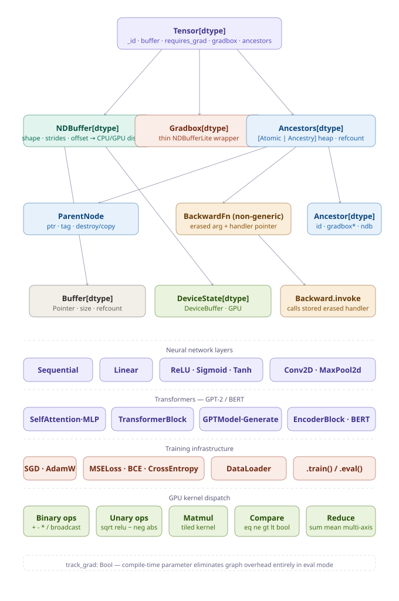
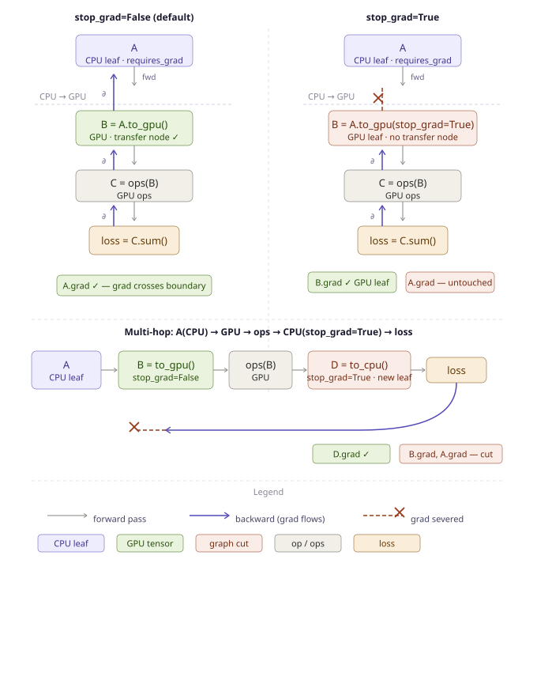

# Tenmo — Autograd Deep Dive

This document explains **how forward and backward pass work** in Tenmo's autograd system, with real code from the implementation.

---
## Architecture



---
## Why This Matters

You could use PyTorch. It works. So why does Tenmo reimplement autograd from scratch in Mojo?

**1. You can read every line.**
No hidden CUDA kernels. No opaque `torch.autograd.Function`. Every backward pass is plain Mojo code in `backpropagation.mojo` — readable, checkable, optimizable.

**2. The design is principled.**
- Type-erased dispatch instead of variant explosion
- Lightweight ancestry handles instead of recursive Tensor copies
- Shared-from-birth gradient storage for memory safety
- Compile-time graph elimination (`track_grad: Bool`)

**3. Zero overhead in inference.**
`model.eval()` switches off gradient tracking at compile time. No runtime `if requires_grad:` branches. Pure forward binary.

**4. GPU-native.**
Gradient flow crosses CPU↔GPU boundaries automatically.

If you want to *understand* autograd — not just use it — this document walks through the real implementation.

---

## 1. The Core Data Structures

### Tensor Fields

```mojo
struct Tensor[dtype: DType](
    ImplicitlyCopyable & Sized & Writable & Absable & Equatable & Iterable
):
```

### Gradbox — Gradient Storage

```mojo
struct Gradbox[dtype: DType](
    ImplicitlyCopyable & Sized & Writable & Equatable & Absable
):
    var handle: NDBufferLite[Self.dtype]
```

**Key design**: Gradbox is a thin wrapper over its `NDBufferLite` handle. Gradient storage comes from the Buffer's `[rc|data]` block, allocated **shared-from-birth**, so the Buffer's atomic refcount (not a Gradbox-owned one) keeps the gradient storage alive across Mojo's ASAP destruction of intermediates. `var b = a` aliases the same gradient storage (refcount bump); `clone()` deep-copies. The former combined `[Atomic | NDBuffer]` handle was removed in the 2026-08-29 storage cleanup.

### Ancestor — Lightweight Parent Handle

```mojo
struct Ancestor[dtype: DType](ImplicitlyCopyable):
    var _id: UInt                           # graph traversal key
    var requires_grad: Bool                 # skip gradient update if False
    var gradbox: Optional[Gradbox[Self.dtype]]   # gradient storage (inline via Optional)
    var ndb: NDBufferLite[Self.dtype]       # data+layout (empty unless needs_parent_data=True)
    var parents: Optional[Ancestors[Self.dtype]] # recursive ancestry chain
```

**Why not store full Tensors?** The old design copied entire Tensors at every `add_ancestry` call — triggering recursive copies, gradbox allocations, and heap blocks. `Ancestor` carries only what backward actually needs.

### Ancestry/Ancestors — Dtype-Erased Parent Storage

The parent list behind every node is **dtype-erased** (node erasure, 2026-08):

```mojo
struct ParentNode(ImplicitlyCopyable):
    var ptr: Pointer[UInt8, MutUntrackedOrigin]  # byte pointer to a true Ancestor[dtype]
    var tag: DType                               # stored node's dtype
    var destroy_fn: DestroyerFn                  # instantiated at wrap time
    var copy_fn: CopyFn

struct Ancestry(Sized & Movable):
    var origins: List[ParentNode]   # dtype-erased nodes
    var backwardFn: BackwardFn      # non-generic container

struct Ancestors[dtype: DType](Sized & ImplicitlyCopyable):
    # refcounted handle over one combined [Atomic | Ancestry] heap allocation
    var _ptr: Optional[Pointer[Ancestry, MutUntrackedOrigin]]
    var _refcount: Optional[Pointer[Atomic[UInt64], MutUntrackedOrigin]]
```

Every op snapshots its parents in O(1) via the shared refcounted handle instead
of deep-copying subtrees. Because storage is erased, one backward traversal can
mix dtypes — e.g. an `f32` leaf reached through an `f16` cast: `to_dtype`
registers `ToDtypeBackward[src, dst]` (`cast.mojo`) for float→float conversions,
registration uses `append_erased[pt]`, and backward restores nodes with
`get_erased(i).as[T]()` (tag-checked in debug). Same-dtype accessors
(`get`/`ref_get`) assert tags too.

### BackwardFn — Type-Erased Handler + Argument

```mojo
struct BackwardFn(ImplicitlyCopyable):        # deliberately non-generic
    var ptr: Pointer[UInt8, MutUntrackedOrigin]  # type-erased argument payload
    var destroy: DestroyerFn                     # custom destructor
    var copy_fn: CopyFn                          # custom copier
    var needs_parent_data: Bool                  # whether backward reads parent shape/buffer
    var backward_fn: BackwardFnHandle            # type-erased handler pointer
```

`BackwardFn` is **non-generic** — the dtype parameter carried no storage
meaning, and dropping it lets one graph mix dtypes across cast edges.
Payload-generic factories take an explicit leading dtype parameter:
`null_arg[dtype]`, `boolean_arg[dtype]`, `scalar_arg[dtype]`,
`integer_arg[dtype]`, `from_intarray[dtype]`, `from_buffer[dtype]`,
`from_ndbuffer[dtype]`. The argument taxonomy:

| Payload | Carries | Used by |
|---|---|---|
| `NullArg` | nothing | most ops |
| `Boolean` | `Bool` | dropout-style ops |
| `ScalarArg` | `Scalar[dtype]` | scalar variants |
| `Integer` | `Int` | axis-parameterized ops |
| `IntArrayArg` | `IntArray` | transpose/unsqueeze axes |
| `BufferArg` / `NDBufferArg` | forward data | ReLU mask; Sigmoid/Tanh/Exp outputs |

`BackwardFn` carries **both** the argument payload and the backward handler, so
the ancestor graph never references a graph type (`Ancestor`, `Tensor`). The
handler is lifted into a raw-pointer call pointer via `make_backward_fn_handle`
— breaking the type-level recursion that stalled GPU codegen.

This is the key: **direct dispatch** — `Backward.invoke` calls the stored
handler pointer; there is no op-code dispatch table.

---

## 2. Forward Pass — Building the Computational Graph

### Example: `c = a * 42 + b`

```mojo
var a = Tensor.d1([1.0, 2.0, 3.0], requires_grad=True)
var b = Tensor.d1([1.0, 2.0, 3.0], requires_grad=True)

var c = a * 42 + b
```

### Step-by-step:

#### 2.1 `a * 42` (MultiplyScalar.forward)

From `tenmo/multiplication.mojo` — `MultiplyScalar.forward`:

```mojo
struct MultiplyScalar[dtype: DType](ImplicitlyCopyable, RegisterPassable):
    @staticmethod
    def forward[
        track_grad: Bool = True
    ](
        self: Tensor[Self.dtype], factor: Scalar[Self.dtype], sync: Bool = True
    ) -> Tensor[Self.dtype]:
        var out: Tensor[Self.dtype] = Tensor[Self.dtype](
            self.buffer.scalar_ops[Multiply](factor, sync=sync),
            requires_grad=False,
        )

        comptime if track_grad:
            if self.requires_grad:
                out.requires_grad_(True)
                var backwardFn = BackwardFn.scalar_arg[Self.dtype](
                    factor,
                    MultiplyBackwardScalar[Self.dtype](),
                )
                out.add_ancestry(backwardFn^, self)

        return out^
```

**What happens:**
1. Buffer performs element-wise multiplication: `[1,2,3] * 42 = [42,84,126]`
2. If `a.requires_grad = True`, set output's gradient flag
3. Create `BackwardFn` with the scalar value `42` and the `MultiplyBackwardScalar` handler
4. Call `out.add_ancestry(backwardFn^, self)` — stores:
   - The type-erased backward function (argument + handler pointer)
   - A lightweight `Ancestor` handle to `a` (not a full copy!)

#### 2.2 `result + b` (Adder.forward)

From `tenmo/addition.mojo` — `Adder.forward`:

```mojo
struct Adder[dtype: DType](Copyable, RegisterPassable):
    @staticmethod
    def forward[
        track_grad: Bool = True
    ](
        self: Tensor[Self.dtype], other: Tensor[Self.dtype], sync: Bool = True
    ) -> Tensor[Self.dtype]:
        if not self.broadcastable(other):
            panic("Tensor addition dimension mismatch...")

        var out = Tensor[Self.dtype](
            self.buffer.arithmetic_ops[Add](other.buffer, sync=sync),
            requires_grad=False,
        )

        comptime if track_grad:
            if self.requires_grad or other.requires_grad:
                out.requires_grad_(True)
                if self.shape() == other.shape():
                    var backwardFn = BackwardFn.null_arg[Self.dtype](
                        AddBackward[Self.dtype]()
                    )
                    if self.requires_grad and other.requires_grad:
                        out.add_ancestry(backwardFn^, self, other)
                    elif self.requires_grad:
                        out.add_ancestry(backwardFn^, self)
                    else:
                        out.add_ancestry(backwardFn^, other)
                else:
                    var backwardFn = BackwardFn.null_arg[Self.dtype](
                        AddBroadcastBackward[Self.dtype](),
                    )
                    backwardFn.needs_parent_data = True
                    out.add_ancestry(backwardFn^, self, other)

        return out^
```

**What happens:**
1. Buffer performs element-wise addition: `[42,84,126] + [1,2,3] = [43,86,129]`
2. Sets up ancestry with an `AddBackward` handler (same-shape) or `AddBroadcastBackward` (broadcast, with `needs_parent_data = True` — an alias for `BroadcastBackward[dtype, augment=False, lhs_op=AddTensor, rhs_op=AddTensor]`)
3. Records parent handles to both tensors that require gradients

---

## 3. Backward Pass — Computing Gradients

### Triggering Backward

```mojo
var loss = c.sum()   # Scalar loss for gradient computation
loss.backward()     # Initiates reverse-mode differentiation
```

### The Dispatch Mechanism

From `tenmo/backpropagation.mojo`:

```mojo
struct Backward[dtype: DType](RegisterPassable & ImplicitlyCopyable):
    @staticmethod
    def invoke(
        var output: Ancestor[Self.dtype],
        mut parent_ids: List[UInt],
    ) raises:
        if not output.has_ancestry():
            print("Inside Backward invoke: output ancestry is not set")
            return
        # Handler-boundary invariant: every backward handler receives a
        # contiguous, zero-offset gradbox (debug-checked, erased in release).
        ref incoming_gb = output.gradients()
        debug_assert(
            incoming_gb.buffer().is_contiguous()
            and incoming_gb.buffer().offset == 0,
            "Backward.invoke: incoming gradbox must be contiguous with"
            " zero offset",
        )
        ref arg = output.ancestry().backward_fn()
        var output_ptr = (
            Pointer(to=output)
            .unsafe_origin_cast[MutAnyOrigin]()
            .unsafe_bitcast[UInt8]()
        )
        var parent_ids_ptr = (
            Pointer(to=parent_ids)
            .unsafe_origin_cast[MutAnyOrigin]()
            .unsafe_bitcast[UInt8]()
        )
        arg.backward_fn(output_ptr, parent_ids_ptr)
```

`BackwardFn` stores a **type-erased call pointer** to the specific handler that
was built at the forward site. `Backward.invoke` calls that pointer directly —
there is no `op_code` jump table and no variant extraction. The raw-pointer
signature (`Pointer[UInt8]`, `Pointer[UInt8]`) is the reason
the ancestor graph can carry a backward function without referencing a graph
type: the closure body reconstructs the typed `Ancestor` and `List[UInt]` at the
call site. Intermediate grads always clear once consumed (like views);
transfer nodes never clear.

Each handler receives a `mut parent_ids: List[UInt]` that it fills with the IDs of
parents that received gradient updates. The caller uses this list to decrement
fan-in counters. Handlers call `parent.update_grad()` internally — no return value.

### Example: Backward for `a * 42`

From `tenmo/multiplication.mojo`:

```mojo
@fieldwise_init
struct MultiplyBackwardScalar[dtype: DType](
    BackwardFnType, ImplicitlyCopyable, RegisterPassable
):
    comptime datatype = Self.dtype
    @staticmethod
    def backward(
        var output: Ancestor[Self.dtype],
        mut parent_ids: List[UInt],
    ):
        var factor = (
            output.ancestry().backward_fn().get[ScalarArg[Self.dtype]]().value
        )  # = 42

        ref gradbox = output.gradients()  # ∂loss/∂c
        var ancestor = output.ancestry().get(0)
        var scaled_gradbox = gradbox * factor
        ancestor.update_grad(scaled_gradbox^, AddTensor, None)
        parent_ids.append(ancestor._id)
        gradbox.zero_grad()  # intermediates always clear once consumed
```

### Example: Backward for `a + b`

From `tenmo/addition.mojo`:

```mojo
@fieldwise_init
struct AddBackward[dtype: DType](BackwardFnType, ImplicitlyCopyable, RegisterPassable):
    comptime datatype = Self.dtype
    @staticmethod
    def backward(
        var output: Ancestor[Self.dtype],
        mut parent_ids: List[UInt],
    ):
        var gradbox = output.gradients()
        var count = len(output.ancestry())

        if count == 1:
            var ancestor = output.ancestry().get(0)
            ancestor.update_grad(gradbox^, AddTensor, None)
            parent_ids.append(ancestor._id)
        else:
            var ancestor_lhs = output.ancestry().get(0)
            var ancestor_rhs = output.ancestry().get(1)
            var lhs_requires_grad = ancestor_lhs.requires_grad
            var rhs_requires_grad = ancestor_rhs.requires_grad

            if lhs_requires_grad and rhs_requires_grad:
                ancestor_lhs.update_grad(gradbox, AddTensor, None)
                parent_ids.append(ancestor_lhs._id)
                ancestor_rhs.update_grad(gradbox, AddTensor, None)
                parent_ids.append(ancestor_rhs._id)

            elif lhs_requires_grad and not rhs_requires_grad:
                ancestor_lhs.update_grad(gradbox, AddTensor, None)
                parent_ids.append(ancestor_lhs._id)

            elif not lhs_requires_grad and rhs_requires_grad:
                ancestor_rhs.update_grad(gradbox, AddTensor, None)
                parent_ids.append(ancestor_rhs._id)

            else:
                pass
        gradbox.zero_grad()  # intermediates always clear once consumed
```

**Key insight**: For addition, ∂(a+b)/∂a = ∂(a+b)/∂b = 1, so the gradient passes through unchanged.

---

## 4. The Full Forward-Backward Trace

### Forward:

```
a = [1,2,3], requires_grad = True
b = [1,2,3], requires_grad = True

c = a * 42
  → c = [42,84,126]
  → ancestors = [Ancestor(a)], backward_fn = BackwardFn(scalar 42, MultiplyBackwardScalar)

d = c + b
  → d = [43,86,129]
  → ancestors = [Ancestor(c), Ancestor(b)], backward_fn = BackwardFn(null, AddBackward)
```

### Backward:

```
loss = d.sum() = 258
loss.backward()
  → Phase 1: seed gradbox of d (loss) with [1]

  → Phase 2: DFS from d → ancestors of c, b → ancestors of a
             fanin: {d:0, c:1, b:1, a:1}  (c depends on d, b depends on d ...)

  → Phase 3: ready_queue = [d]
     pop d → Backward.invoke(d, parent_ids)
        handler = AddBackward
        grad_d = [1,1,1]
        propagates to c: c.update_grad(grad_d, AddTensor)  → c.grad = [1,1,1]
        propagates to b: b.update_grad(grad_d, AddTensor)  → b.grad = [1,1,1]
        parent_ids = [c._id, b._id]
        fanin: {c:0, b:0, a:1}  → enqueue c, b

     pop c → Backward.invoke(c, parent_ids)
        handler = MultiplyBackwardScalar
        grad_c = [1,1,1], factor = 42
        a.update_grad(grad_c * 42, AddTensor)              → a.grad = [42,42,42]
        parent_ids = [a._id]
        fanin: {a:0, b:0}  → enqueue a

     pop b → Backward.invoke(b, parent_ids)
        b has no ancestry → returns, parent_ids empty
        fanin: {a:0}  → nothing to enqueue

     pop a → Backward.invoke(a, parent_ids)
        a has no ancestry (leaf) → returns, parent_ids empty
        fanin: {}  → done
```

**Final gradients:**
- `a.grad() = [42, 42, 42]` — because ∂(a*42)/∂a = 42 at every position
- `b.grad() = [1, 1, 1]` — because ∂(c+b)/∂b = 1

---

## 5. Key Design Decisions

### Why is BackwardFn type-erased?

```mojo
struct BackwardFn(ImplicitlyCopyable):          # non-generic by design
    var ptr: Pointer[UInt8, MutUntrackedOrigin]  # type-erased payload
    var destroy: DestroyerFn                     # custom destructor
    var copy_fn: CopyFn                          # custom copier
    var needs_parent_data: Bool                  # whether backward reads parent data
    var backward_fn: BackwardFnHandle            # erased call pointer
```

- **No variant explosion**: Each op doesn't need a custom Variant type
- **Direct dispatch**: Each node stores the one erased handler pointer it needs
  — `Backward.invoke` calls it directly, no integer tag, no jump-table elaboration
- **Custom cleanup**: Each argument type knows how to destroy/copy itself
- **GPU recursion invariant**: The raw-pointer signature means nothing stored in
  the ancestor graph (`Ancestors` → `Optional[BackwardFn]` → payload) references a
  graph type (`Ancestor`/`Tensor`) — this is what keeps GPU codegen compiling

### Why Ancestor instead of Tensor copies?

| Full Tensor Copy | Ancestor Handle |
|----------------|----------------|
| Recursive gradbox allocation | No new gradbox |
| Full NDBuffer copy | NDBuffer refcount bump |
| Copy backwardFn heap block | Reference existing argument |
| O(n) per ancestry entry | O(1) per ancestry entry |

### Why does gradient storage survive Mojo's ASAP destruction?

When Mojo ASAP-destroys intermediate tensors:
1. Dropping a `Tensor` drops its `Gradbox` handle
2. The handle's `NDBuffer` copy-init/deinit bumps the Buffer refcount
3. If other `Ancestor` copies in the graph still reference the storage → refcount stays > 0
4. Last reference frees the `[rc|data]` block

This prevents **dangling pointers** in the autograd graph without a per-Gradbox atomic.

### Why track_grad is compile-time?

```mojo
def forward[track_grad: Bool = True](self, factor):
    # If track_grad = False at compile time:
    # - No graph building code generated
    # - No ancestry setup
    # - Pure forward pass binary
    # If track_grad = True:
    # - Full graph construction
```

Using `model.eval()` switches the implicit default to `False` — zero overhead in inference.

---

## 6. Operation Support

Tenmo supports **50+ operations** with backward passes:

| Category | Operations |
|----------|-----------|
| Arithmetic | `+`, `-`, `*`, `/`, `**` |
| Scalar variants | `tensor + scalar`, `tensor * scalar` |
| Reductions | `sum`, `mean`, `max`, `min` |
| Linear Algebra | `matmul`, `dot`, `outer` |
| Activations | `relu`, `gelu`, `sigmoid`, `tanh`, `softmax` |
| Reshaping | `reshape`, `flatten`, `squeeze`, `unsqueeze`, `transpose`, `permute` |
| View ops | `view`, `expand`, `tile`, `repeat` |
| Utility | `concat`, `stack`, `pad`, `clip`, `masked_fill`, `where`, `triu`, `tril`, `cumsum`, `gather`, `to_dtype` (grad-tracked cast — gradients cross dtype boundaries via `ToDtypeBackward`) |
| Loss | `MSELoss`, `CrossEntropyLoss`, `BCELoss` |

Each operation follows the same pattern:
1. **Forward**: Compute result, record `BackwardFn` (argument + handler pointer) + parent `Ancestor` handles
2. **Backward**: Call the stored handler directly, compute gradient contributions, accumulate to parents

---

## 7. GPU Support

Most forward and backward operations work on GPU:
- Tensor arithmetic, reductions, activations, etc.
- Kernel dispatch (CPU vs GPU) happens inside NDBuffer operations
- `DType.bool` is handled correctly via internal `uint8` storage

```mojo
var a = Tensor.d2([[1,2],[3,4]], requires_grad=True)
var a_gpu = a.to_gpu()
var b = a_gpu * 2
var loss = b.sum()
loss.backward()
a.grad().print()  # Gradients flow back to original CPU tensor
```

### Gradient Flow Across Device Boundaries

The `stop_grad` parameter on `to_gpu()` and `to_cpu()` controls whether a device
transfer registers a backward node in the compute graph. This lets you choose
between full cross-device grad flow and GPU-native training where weights live
permanently on the GPU.



#### `stop_grad=False` (default) — transparent boundaries

The transfer registers a `DeviceTransferBackward` node. Gradients tunnel through
device boundaries as if no transfer happened. The origin tensor receives its
gradient exactly as it would from a same-device computation.

```mojo
var a = Tensor.d1([1.0, 2.0, 3.0], requires_grad=True)  # CPU leaf
var b = a.to_gpu()          # stop_grad=False — transfer node registered
var loss = (b * 2).sum()
loss.backward()
# grad flows: loss → ops → b → DeviceTransferBackward → a
a.grad().print()            # ✓ [2.0, 2.0, 2.0]
```

#### `stop_grad=True` — new leaf on target device

No backward node is registered. The destination tensor becomes a new independent
leaf on the target device. Gradients accumulate there and never cross back.

```mojo
var a = Tensor.d1([1.0, 2.0, 3.0], requires_grad=True)  # CPU leaf
var b = a.to_gpu(stop_grad=True)   # B is a new GPU leaf — graph severed
var loss = (b * 2).sum()
loss.backward()
b.grad().print()   # ✓ [2.0, 2.0, 2.0]  grad stays on GPU
a.grad().print()   # untouched — backward never crossed the boundary
```

#### Multi-hop chains — each boundary is independent

Every transfer independently applies its own `stop_grad` rule. Grad flow is only
as wide as the narrowest `stop_grad=True` cut in the entire chain.

```mojo
# CPU → GPU (transparent) → ops → CPU (stop_grad=True, new CPU leaf) → loss
var a = Tensor.ones(Shape(4), requires_grad=True)
var b = a.to_gpu()                    # stop_grad=False — transparent
var c = b * 3.0                       # GPU op
var d = c.to_cpu(stop_grad=True)      # D becomes new CPU leaf — chain cut here
var loss = d.sum()
loss.backward()
d.grad().print()   # ✓ [3.0, 3.0, 3.0]
a.grad().print()   # untouched — cut at to_cpu boundary
```

#### Grad flow rules summary

| Scenario | `stop_grad` | Grad destination |
|---|---|---|
| `A → to_gpu() → ops → loss` | `False` | `A.grad` (CPU origin) |
| `A → to_gpu(stop_grad=True) → ops → loss` | `True` | `B.grad` (GPU leaf) |
| `A → to_gpu() → ops → to_cpu() → loss` | both `False` | `A.grad` (crosses both) |
| `A → to_gpu(stop_grad=True) → ops → to_cpu() → loss` | first `True` | `B.grad` (GPU leaf) |
| `A → to_gpu() → ops → to_cpu(stop_grad=True) → loss` | second `True` | `D.grad` (CPU leaf) |

#### Recommended training pattern

Transfer model weights to GPU once with `stop_grad=True`, making them permanent
GPU leaves. Run the entire training loop on GPU — gradients accumulate on the
GPU parameters directly, with no cross-device transfer on every backward pass.
Transfer weights back to CPU after training to persist them.

```mojo
# Setup — weights become GPU leaves, no backward node registered
model = model.to_gpu(stop_grad=True)
var optimizer = SGD(model.parameters(), lr=0.01, momentum=0.9)

# Training loop — everything on GPU
for epoch in range(epochs):
    var x_gpu = batch.features.to_gpu()   # batch transfer, stop_grad=False
    var loss = criterion(model(x_gpu), batch.labels.to_gpu())
    optimizer.zero_grad()
    loss.backward()       # grads stay on GPU — no device hop
    optimizer.step()

# Persist — weights come back to CPU as new CPU leaves
model = model.to_cpu(stop_grad=True)
```

### Known gaps

- **Module layers on GPU**: `Conv2D` forward runs on GPU (`ConvGpu`); its backward round-trips through CPU. `MaxPool2d` has no GPU path. `arange`/`linspace` build on CPU; non-`constant` `Pad` raises on GPU.

---

## 8. Summary

| Component | Role |
|-----------|------|
| `Tensor` | Main type with buffer, gradient flag, ancestry |
| `Gradbox` | Thin wrapper over its `NDBuffer`; gradient storage lives in the Buffer's shared-from-birth `[rc\|data]` block |
| `Ancestor` | Lightweight handle for graph traversal |
| `ParentNode` / `Ancestry` | Dtype-erased parent storage (`List[ParentNode]`) behind the refcounted `Ancestors` handle |
| `BackwardFn` | Non-generic type-erased argument + handler pointer, stored per node |
| `Backward.invoke()` | Direct call to the stored handler pointer |
| `track_grad` | Compile-time graph elimination |

The system provides **PyTorch-like ergonomics** with **visible, optimizable internals** — every operation readable in pure Mojo.
